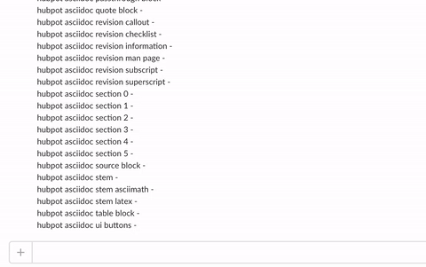

= hubot-asciidoc
:toc: macro
:sectnums:
:setanchors:
// settings:
ifdef::env-github,env-browser[:outfilesuffix: .adoc]
// URIs:
:uri-repo: https://github.com/anthonny/hubot-asciidoc
:uri-help-base: https://help.github.com/articles
:uri-issues: {uri-repo}/issues
:uri-fork-help: {uri-help-base}/fork-a-repo
:uri-branch-help: {uri-fork-help}#create-branches
:uri-pr-help: {uri-help-base}/using-pull-requests
:uri-gist: https://gist.github.com
// GitHub Admonitions
ifndef::env-github[:icons: font]
ifdef::env-github,env-browser[]
:toc: preamble
:toclevels: 1
endif::[]
ifdef::env-github[]
:status:
:outfilesuffix: .adoc
:!toc-title:
:caution-caption: :fire:
:important-caption: :exclamation:
:note-caption: :paperclip:
:tip-caption: :bulb:
:warning-caption: :warning:
endif::[]

A hubot script for https://slack.com[Slack] that give you instant access to Asciidoctor syntax with a few keystrokes.

toc::[]

== Installation

.Pre-requisites
NOTE: You need `npm` and the https://github.com/slackhq/hubot-slack[SlackHQ SlackBot] installed.

. Run `npm install hubot-asciidoc --save`.
. Declare `hubot-asciidoc` in the Hubot `external-scripts.json` file:
+
[source,json]
----
[
  "hubot-asciidoc"
]
----

== Sample Interactions

=== See All Commands

To see all available commands, type `@<botname> help asciidoc`.


=== Retrieve AsciiDoc Table Syntax

In Slack, type `@<botname> asciidoc table block` to display the table syntax.



== Contributing

=== License Agreement

By contributing changes to this repository, you agree to license your contributions under the <<LICENSE#,MIT license>>.
This ensures your contributions have the same license as the project and that the community is free to use your contributions.
You also assert that you are the original author of the work that you are contributing unless otherwise stated.

=== Submitting an Issue

We use the {uri-issues}[issue tracker on GitHub] associated with this project to track bugs and features.

Before submitting a bug report or feature request, check to make sure it hasn't already been submitted.

When submitting a bug report, please include any details that may help reproduce the bug, including the asciidoc content or logs.

=== Contributing a Snippet

. Clone https://github.com/anthonny/hubot-asciidoc
. Open `/hubot-asciidoc/src/asciidoc.coffee`.
. See <<Snippet>> for the block syntax required.
. Create the new block.
. Add a comment to the top of the file, in alphabetical order.
The comments are displayed when you run `@<botname> help asciidoc`.
. Push your changes to GitHub and create your PR.

[[Snippet]]
.Anatomy of a Snippet
[source,json]
----
'comment': <1>
    title: "comment" <2>
    descriptionMoreURL: "http://asciidoctor.org/docs/user-manual/#comments" <3>
    description: """ <4>
    ```<5>
    // A single-line comment.
    ```
    """
----
<1> The _lowercase_ name of the snippet you want other users to specify in the command.
<2> The _lowercase_ title of the snippet block when returned in Slack.
<3> The direct link to the Asciidoctor User Guide page describing more about the block.
This is linked in the title.
<4> The snippet block, delimited by three quotation marks.
<5> The syntax you want to display in Slack is enclosed inside three back-ticks.

You'll notice that the snippet is hand-crafted.
It's up to you what you put into the snippets, so here are some tips when creating them:

* Be as detailed as you can within the scope of the snippet.
* Keep the snippet as atomic as possible.

TIP: If you have five different table examples you want to propose, create five snippets.

==== Writing and Executing Tests

TODO
